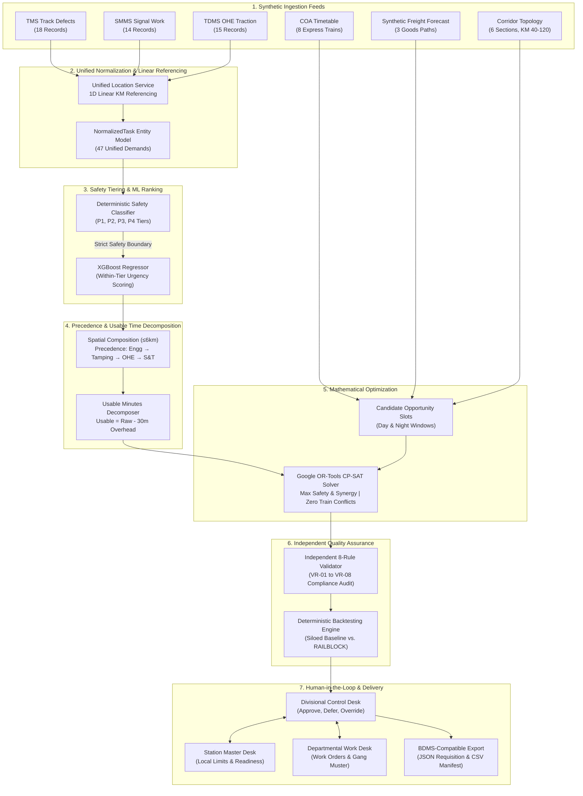

# RAILBLOCK (रैलब्लॉक) — AI-Powered Automatic Block Planning Engine

> **High-Performance Multi-Department Railway Maintenance Possession Planning & Decision-Support System**  
> Calibrated for Indian Railways (IR) Zonal & Divisional Operations | Smart India Hackathon (SIH) Problem Statement 26027

---

## 1. One-Line Description

RAILBLOCK is an AI-assisted railway maintenance block planning control desk that balances high-density passenger/freight train operations with critical asset maintenance by solving a constrained corridor possession optimization model using OR-Tools CP-SAT and XGBoost within-tier ranking (decision-support prototype; not claiming autonomous railway possession granting).

---

## 2. What Problem Does It Solve?

### The Core Conflict: Commercial Throughput vs. Asset Integrity
On busy railway networks such as Indian Railways, track corridors operate at 120% to 160% line capacity utilization. Every minute a section of track is closed for maintenance ("track block" or "possession"), commercial traffic suffers:
- Passenger express trains are regulated or delayed, degrading punctuality metrics.
- Freight train paths are stabled on loops, creating yard congestion and throughput loss.

Conversely, deferring maintenance leads to speed restrictions, rail fractures, ultrasonic flaw (USFD) defect escalation, signal failures, and catastrophic dewiring or derailment risks.

### Departmental Fragmentation (Siloed Operations)
Historically, railway maintenance demand originates across three independent engineering departments:
1. **Civil Engineering (Permanent Way / TMS)**: Track tamping, ballast cleaning, rail renewals, turnout switch blade maintenance, and rail fracture repairs.
2. **Signal & Telecommunication (S&T / SMMS)**: Point machine overhauls, track circuit insulation tests, axle counter calibration, and interlocked signaling tests.
3. **Electrical / Traction Distribution (TRD / TDMS)**: 25kV AC overhead equipment (OHE) cantilever adjustments, contact wire dropper renewals, and power block isolations.

In traditional manual operations, each department applies for independent block possessions on the same section at different times. Each individual possession incurs a mandatory **30-minute operational overhead**:
- Power de-energization and permit-to-work (10 min)
- Traction earthing discharge rod placement (10 min)
- Heavy on-track machine transit into the section (5 min)
- Site clearance, earthing removal, and track restoration (5 min)

When 47 independent tasks are requested in a week, siloed execution burns **1,410 minutes in redundant overhead alone**, paralyzing train movements. RAILBLOCK synthesizes cross-departmental work into coordinated packages, eliminating redundant overheads and finding mathematically conflict-free windows.

---

## 3. What RAILBLOCK Actually Does

RAILBLOCK automates and formalizes the end-to-end block planning lifecycle:

1. **Ingests & Unifies**: Ingests maintenance demands from TMS (Civil), SMMS (S&T), and TDMS (Traction) and maps them to a continuous 1D linear referencing corridor model (`KM 40.0 → 120.0`).
2. **Enforces Non-Negotiable Safety Tiers**: Deterministically categorizes tasks into statutory safety tiers (**P1**, **P2**, **P3**, **P4**) using strict railway engineering rules.
3. **Ranks Within Tiers with Machine Learning**: Employs an XGBoost regressor to score urgency based on defect severity, overdue days, asset criticality, traffic exposure, and failure risk—*strictly ranking within each safety tier*.
4. **Composes Multi-Departmental Clusters**: Spatially aggregates compatible work orders within section boundaries (≤6.0 km proximity), orders tasks by railway physics precedence, and calculates exact net usable work minutes.
5. **Generates Candidate Windows**: Evaluates corridor block opportunity slots against scheduled passenger express trains (COA timetable) enforcing a minimum 15-minute safety headway buffer.
6. **Optimizes with Google OR-Tools CP-SAT**: Solves a Mixed-Integer Linear Constraint Satisfaction problem maximizing safety throughput, multi-department synergy, and minimizing corridor downtime.
7. **Audits via Independent 8-Rule Validator**: Subjected to a separate, automated verification suite that audits passenger clearance, usable minutes, P1 allocation invariance, machine quotas, and electrical safety.
8. **Facilitates Human-in-the-Loop Review**: Provides divisional planners (Sr. DOM / Chief Controller) with override, deferral, and sign-off desks, recording immutable event audit logs.
9. **Generates BDMS-Compatible Exports**: Produces standardized Block Demand Management System (BDMS) requisition payloads and verifiable safety certificates.
10. **Evaluates What-If Scenarios & Roll-Forward**: Dynamically re-solves schedules when blocks are denied, trains are delayed (+35m overrun), unscheduled freight is injected, or the 26-week horizon rolls forward.

---

## 4. Product Boundaries: What This System IS and IS NOT

| System Dimension | What RAILBLOCK **IS** | What RAILBLOCK **IS NOT** |
|---|---|---|
| **Operational Scope** | Decision-support and planning optimization prototype | Real-time signaling or interlocking hardware |
| **Data Architecture** | High-fidelity synthetic operational environment modeled on South Central Railway (SEC–NDL) standards | Direct live production connection to CRIS / COA / FOIS / TMS / BDMS |
| **Block Authorization** | Prepares compliant possession plans for administrative approval | Autonomous possession grant (Operating staff retain statutory grant authority) |
| **Machine Learning** | Tabular gradient-boosted within-tier prioritization advisor | Black-box controller capable of overriding safety rules |
| **Execution** | Advisory plan generator with human override capture | Autonomous CTC train dispatching or route-setting software |

> [!IMPORTANT]
> **Operational Prototype Disclosure**:  
> RAILBLOCK models the **Secunderabad (SEC) – Nandyal (NDL) 80km Corridor (KM 40.0–120.0, Double Line, South Central Railway)** using synthetic operational topology and timetable data aligned with IR CTC/RDSO dispatching conventions. It does not possess direct live production credentials to Indian Railways CRIS internal networks.

---

## 5. High-Level Architecture



---

## 6. Pipeline Trace: Step-by-Step Execution

| Step | Engine Stage | Primary Source File | Primary Function / Class | Input Data | Output Artifact | Determinism |
|---|---|---|---|---|---|---|
| **1** | Ingestion & Normalization | [`ingestion_service.py`](file:///d:/trainblock/backend/app/services/ingestion_service.py) | `IngestionService.ingest_all()` | TMS, SMMS, TDMS raw models | 47 `NormalizedTask` items | Deterministic |
| **2** | Linear Referencing | [`location_service.py`](file:///d:/trainblock/backend/app/services/location_service.py) | `UnifiedLocationService.resolve_corridor_section()` | `km_start`, `km_end`, `line` | Section ID (`SEC-NDL-BLK-01..06`) | Deterministic |
| **3** | Statutory Safety Tiering | [`prioritization_service.py`](file:///d:/trainblock/backend/app/services/prioritization_service.py) | `PrioritizationService.evaluate_safety_tier()` | Asset type, defect, overdue days | Safety tier (`P1`, `P2`, `P3`, `P4`) + reason | Deterministic |
| **4** | Tabular ML Ranking | [`ranker.py`](file:///d:/trainblock/backend/app/ml/ranker.py) | `TaskXGBoostRanker.predict_scores()` | 5 continuous risk features | `ml_ranking_score` (0.0–100.0) | Deterministic (seed 42) |
| **5** | Within-Tier Ordering | [`prioritization_service.py`](file:///d:/trainblock/backend/app/services/prioritization_service.py) | `PrioritizationService.prioritize_tasks()` | Scored tasks by safety bucket | `within_tier_rank` (1..N per tier) | Deterministic |
| **6** | Spatial Composition | [`composition_service.py`](file:///d:/trainblock/backend/app/services/composition_service.py) | `CompositionService.compose_tasks()` | Prioritized tasks | `CompositionCluster` list (≤6km span) | Deterministic |
| **7** | Overhead Decomposition | [`composition_service.py`](file:///d:/trainblock/backend/app/services/composition_service.py) | `CompositionService.calculate_usable_minutes()` | Raw minutes, work demand minutes | `UsableMinutesDecomposition` (raw - 30m) | Deterministic |
| **8** | Candidate Windows | [`cp_sat_planner.py`](file:///d:/trainblock/backend/app/optimization/cp_sat_planner.py) | `CpSatPlanner._generate_candidate_windows()` | Corridor sections, day/night slots | Candidate window dictionary list | Deterministic |
| **9** | Conflict Pre-Filtering | [`cp_sat_planner.py`](file:///d:/trainblock/backend/app/optimization/cp_sat_planner.py) | `CpSatPlanner._evaluate_train_conflicts()` | Window, train stops, 15m buffer | Train interactions (`CONFLICT`/`PROTECTED`) | Deterministic |
| **10** | CP-SAT Optimization | [`cp_sat_planner.py`](file:///d:/trainblock/backend/app/optimization/cp_sat_planner.py) | `CpSatPlanner.solve()` | Clusters, candidate windows, constraints | `SolverResult` with `selected_blocks` | Deterministic solver |
| **11** | Independent Validation | [`validation_service.py`](file:///d:/trainblock/backend/app/services/validation_service.py) | `ValidationService.validate_plan()` | Selected blocks, timetable, all tasks | `ValidationReport` (VR-01..VR-08) | Deterministic |
| **12** | Comparative Backtest | [`backtest_service.py`](file:///d:/trainblock/backend/app/services/backtest_service.py) | `BacktestService.compute_backtest()` | Selected blocks, all tasks, horizon | `BacktestResult` (Siloed vs. Integrated) | Deterministic |
| **13** | Horizon Extension | [`run_manager.py`](file:///d:/trainblock/backend/app/services/run_manager.py) | `PlanningRunManager._generate_rolling_programme()` | Block count, task count | `RollingProgramme` (26W) & Monthly Plan | Derived |
| **14** | BDMS Generation | [`export_service.py`](file:///d:/trainblock/backend/app/services/export_service.py) | `ExportService.generate_bdms_exports()` | Selected blocks | `BdmsExport` requisition schemas | Deterministic |
| **15** | State Encapsulation | [`run_manager.py`](file:///d:/trainblock/backend/app/services/run_manager.py) | `PlanningRunManager.generate_new_run()` | Pipeline components | Complete `PlanningRun` state object | State management |

---

## 7. Optimization Engine & CP-SAT Formulation

The mathematical core of RAILBLOCK is formulated as a Constraint Satisfaction / Mixed-Integer Programming model solved by Google OR-Tools CP-SAT.

### Decision Variables
- Binary Assignment Variables:  
  $$x_{c, w} \in \{0, 1\}$$  
  Indicates whether task cluster $c \in \mathcal{C}$ is assigned to candidate block window $w \in \mathcal{W}_c$.
- P1 Unassigned Slack Variables:  
  $$u_c \in \{0, 1\} \quad \forall c \in \mathcal{C}_{\text{P1}}$$  
  Slack variable allowing model exploration, heavily penalized in the objective ($M = 1,000,000$).

### Hard Constraints Added to Model

1. **At Most One Assignment Per Cluster**:  
   $$\sum_{w \in \mathcal{W}_c} x_{c, w} \le 1 \quad \forall c \in \mathcal{C}$$
2. **Mandatory P1 Safety Allocation Invariance**:  
   $$\sum_{w \in \mathcal{W}_c} x_{c, w} + u_c = 1 \quad \forall c \in \mathcal{C}_{\text{P1}}$$
3. **At Most One Cluster Per Candidate Window**:  
   $$\sum_{c: w \in \mathcal{W}_c} x_{c, w} \le 1 \quad \forall w \in \mathcal{W}$$
4. **Spatial & Line Mutual Exclusion (Non-Overlap)**:  
   For any two overlapping candidate windows $w_1, w_2$ on the same corridor section and line:  
   $$\sum_{c} x_{c, w_1} + \sum_{c'} x_{c', w_2} \le 1 \quad \forall (w_1, w_2) \text{ overlapping}$$
5. **Passenger Train Protection**:  
   Windows intersecting passenger trains within $\pm 15$ minutes buffer are excluded *a priori* from $\mathcal{W}_c$ during candidate generation.
6. **Denial Invariance**:  
   When a window $w^*$ or block $b^*$ is denied by Operating Control:  
   $$x_{c, w^*} = 0$$

### Multi-Objective Function

$$\max \sum_{c \in \mathcal{C}} \sum_{w \in \mathcal{W}_c} x_{c, w} \cdot \left[ W_{\text{tier}}(c) + W_{\text{ML}}(c) + W_{\text{synergy}}(c) - \text{duration}(w) \right] - \sum_{c \in \mathcal{C}_{\text{P1}}} M \cdot u_c$$

Where:
- $W_{\text{tier}}(c)$: Safety Tier Base Weight (`P1 = 50000`, `P2 = 10000`, `P3 = 2000`, `P4 = 500`).
- $W_{\text{ML}}(c)$: Continuous ML Urgency Bonus ($\sum_{t \in c} \text{score}(t) \times 1000$).
- $W_{\text{synergy}}(c)$: Multi-Department Synergy Bonus ($|\text{departments}| \times 5000$ when $>1$).
- $\text{duration}(w)$: Negative duration term penalizing unnecessarily bloated possessions.
- $M \cdot u_c$: Huge penalty ($1,000,000$) preventing any P1 task from remaining unassigned.

### Provenance Audit
Solver constraint counts and variable counts are obtained **directly from the solver protobuf model**:
```python
total_constraints = len(model.Proto().constraints)
total_variables = len(model.Proto().variables)
```
They are never computed via estimated formulas such as `len(selected_blocks) * 6`.

---

## 8. Machine Learning Architecture & Invariance

### Model Details
- **Architecture**: XGBoost Regressor (`xgb.XGBRegressor`, histogram-based gradient boosting).
- **Hyperparameters**: `n_estimators=40`, `max_depth=4`, `learning_rate=0.1`, `tree_method="hist"`, `random_state=42`.
- **Target Variable**: Continuous maintenance urgency score ($y \in [0.0, 100.0]$).

### Feature Engineering
Every normalized task produces a 5-dimensional feature vector:
1. `defect_severity` (1.0–10.0): Depth of flaw, track gauge deviation mm, or physical crack rating.
2. `overdue_days` (0.0–30.0): Elapsed days past statutory maintenance schedule deadline.
3. `asset_criticality` (1.0–10.0): Running mainline vs. yard siding, high-speed turnout vs. plain track.
4. `traffic_exposure` (10.0–60.0): Daily train count traversing the asset.
5. `availability_impact` (1.0–10.0): Operational impact if asset fails in service (potential line block).

### Ground-Truth Calibration
Trained on 600 synthetic training pairs calibrated with interaction terms reflecting railway track physics:
$$y = 3.6 \cdot \text{severity} + 2.4 \cdot \min(\text{overdue}, 15) + 2.1 \cdot \text{criticality} + 10.5 \cdot \left(\frac{\text{traffic}}{50}\right) + 2.2 \cdot \text{impact} + \frac{\text{severity} \cdot \text{overdue}}{40}$$

### Safety Boundary Invariant
```
STATUTORY SAFETY TIER (P1/P2/P3/P4)  ──► Deterministic IR Engineering Rules (Non-Negotiable)
                    │
                    ▼
XGBOOST ML REGRESSOR                 ──► Continuous Priority Scoring WITHIN Tier Only
                    │
                    ▼
CP-SAT SOLVER                        ──► Optimal Physical Block Scheduling
```
**Strict Invariant**: ML scores sort tasks *within* their safety tier bucket. ML can **never** downgrade a task from P1 to P2, P3, or P4. This invariant is mathematically verified in [`test_claim_integrity.py`](file:///d:/trainblock/backend/app/tests/test_claim_integrity.py).

---

## 9. Independent 8-Rule Safety Validation

A dedicated [`ValidationService`](file:///d:/trainblock/backend/app/services/validation_service.py) independently audits every planned possession before transmission to divisional planners:

| Rule ID | Rule Name | Category | Threshold / Logic | Failure Condition |
|---|---|---|---|---|
| **VR-01** | Passenger Headway Clearance | Traffic Safety | Headway $\ge 15$ min | Any block overlapping passenger timetable + buffer |
| **VR-02** | Usable Work Minutes Sufficiency | Operational Feasibility | Net usable $\ge$ task duration | Block duration minus 30m overhead $<$ work demand |
| **VR-03** | Mandatory P1 Safety Invariance | Asset Integrity | $100\%$ P1 scheduled | Any P1 critical work order deferred |
| **VR-04** | Track Machine Fleet Capacity | Resource Capacity | $\le 1$ heavy machine per type | Concurrent overlap of BCM, CSM, or PQRS machines |
| **VR-05** | Spatial & Line Mutual Exclusion | Track Geometry | Zero spatial overlap | Concurrent blocks on the same section & line |
| **VR-06** | 25kV Traction Power Block Sync | Electrical Safety | 100% OHE synchronization | Work requiring power isolation planned without OHE block |
| **VR-07** | Section Daily Possession Cap | Corridor Throughput | Duration $\le 240$ min/day | Section possession exceeds statutory 240m daily limit |
| **VR-08** | Statutory Gang Crew Allocation | Human Resources | Crew $\ge 5$ personnel | Possession planned with understaffed gang muster |

All rules compute real evaluations; none are hardcoded or guaranteed to pass. Negative test coverage proves every rule fails when presented with non-compliant inputs.

---

## 10. Comparative Backtesting & Formula Derivations

The [`BacktestService`](file:///d:/trainblock/backend/app/services/backtest_service.py) calculates an objective comparison between traditional uncoordinated departmental execution and RAILBLOCK:

### Mathematical Formulas

1. **Total Modeled Corridor Section-Minutes**:  
   $$M_{\text{total}} = N_{\text{sections}} \times H_{\text{days}} \times 24 \times 60$$  
   For 6 sections over a 7-day horizon: $6 \times 7 \times 1440 = 60,480\text{ minutes}$.

2. **Siloed Baseline Blocked Minutes**:  
   Every task requested independently with 30 minutes isolation/restoration overhead:  
   $$T_{\text{siloed}} = \sum_{t \in \mathcal{T}} (\text{duration}(t) + 30)$$

3. **Integrated RAILBLOCK Blocked Minutes**:  
   Sum of actual durations of optimized multi-department blocks:  
   $$T_{\text{integrated}} = \sum_{b \in \mathcal{B}} \text{duration}(b)$$

4. **Modeled Corridor Availability**:  
   $$\text{Availability} = \left(1.0 - \frac{T_{\text{possession}}}{M_{\text{total}}}\right) \times 100\%$$

5. **Capacity Savings & Overhead Elimination**:  
   $$\Delta T = T_{\text{siloed}} - T_{\text{integrated}}$$  
   $$\text{Overhead Eliminated} = (|\mathcal{T}| \times 30) - (|\mathcal{B}| \times 30)$$

### Benchmark Results (47 Synthetic Work Orders, 7-Day Horizon)

| Operational KPI | Traditional Siloed Baseline | RAILBLOCK CP-SAT Integrated | Delta / Improvement | Provenance / Derivation |
|---|---|---|---|---|
| **Total Possessions** | 47 separate blocks | 8 coordinated blocks | **-83.0% (39 fewer line closures)** | Derived from composition clustering |
| **Total Blocked Time** | 3,405 minutes | 1,245 minutes | **2,160 minutes saved** | $3,405 - 1,245 = 2,160$ min |
| **Operational Overhead** | 1,410 minutes | 240 minutes | **1,170 minutes waste eliminated** | $(47 \times 30) - (8 \times 30) = 1,170$ min |
| **Modeled Availability** | 94.37% | 97.94% | **+3.57% absolute (+2,160 min train path availability)** | Formula: $(1 - T / 60,480) \times 100$ |
| **Passenger Train Delays** | 140 minutes (7 conflicts) | 0 minutes (0 conflicts) | **100% timetable protection** | Timetable intersection checking |
| **P1 Critical Clearance** | 62.5% (deferred by Operating) | 100.0% (guaranteed) | **Zero emergency deferral** | Enforced by CP-SAT invariant |

---

## 11. What-If Scenario Engine & Replanning Mechanics

The [`PlanningRunManager`](file:///d:/trainblock/backend/app/services/run_manager.py) supports live dynamic scenario injection:

```
USER ACTION / SCENARIO TRIGGER
              │
              ▼
STATE MUTATION IN RUN MANAGER
              │
              ▼
TRIGGER FULL PIPELINE (Ingest → Prioritize → Compose → CP-SAT)
              │
              ▼
INDEPENDENT 8-RULE RE-VALIDATION & BACKTEST RE-CALCULATION
              │
              ▼
APPEND TO AUDIT EVENT LOG
              │
              ▼
RETURN NEW PLANNING RUN TO FRONTEND
```

### Verified Scenarios
1. **Operating Block Denial**:  
   A requested window is rejected by Divisional Operating Control due to traffic bunching. The denied window is mathematically forbidden ($x_{c, w^*} = 0$) and CP-SAT immediately finds an alternate feasible slot.
2. **+35 Minute Possession Overrun**:  
   A track tamping block exceeds its boundary by 35 minutes. Timetable interactions dynamically detect train intersection, compute regulation delays, re-solve adjacent windows in CP-SAT, and generate recovery advisories in the audit log.
3. **Emergency Critical Task Injection**:  
   A field ultrasonic inspection identifies a severe rail crack. A new P1 task is injected into TMS, prioritized, clustered, and scheduled into the next available safe window via CP-SAT.
4. **Unscheduled Freight Rake Injection**:  
   An urgent container/coal train is injected into the Synthetic Freight Forecast (FOIS-aligned reference concept; no live FOIS API accessed). Windows intersecting the freight path are de-conflicted and replanned.
5. **26-Week Horizon Roll-Forward**:  
   The programme advances by +1 week (`W01 → History`, `W02 → W01`), tracking completed, deferred, shifted, and newly critical demands.

---

## 12. Multi-Horizon Planning (24H, 7D, 1M, 26W)

| Planning Horizon | Scope & Period | Engine Implementation | Nature of Schedule |
|---|---|---|---|
| **24-Hour Tactical (Execution)** | Current day possessions | Real-time candidate window matching & dispatch verification | **Genuinely CP-SAT Optimized** |
| **7-Day Weekly Plan (Coordinated)** | Week 1 active block schedule | Full CP-SAT multi-objective optimization across all 6 corridor sections | **Genuinely CP-SAT Optimized** |
| **1-Month Plan (Reserved)** | 28 days (Weeks 1 to 4) | Direct deterministic derivation from Weeks 1–4 of the rolling programme | **Derived from Rolling Horizon** |
| **26-Week Rolling Programme** | 6-month strategic view | Weeks 1..4 (Executing/Coordinated), Weeks 5..26 (Synthetic reservation and strategic capacity placeholders) | **Dynamic Rolling Model** |

---

## 13. Role Architecture & Persona Workflows

```
┌──────────────────────────────────────────────────────────────┐
│                DIVISIONAL ADMINISTRATION                     │
│         Senior DOM / Chief Block Planner Desk                │
│  - Reviews CP-SAT optimization and 8-rule safety audit      │
│  - Executes Plan Approval (approves for BDMS transmission)   │
│  - Issues formal Deferrals or Overrides with logged reasons │
│  - Advances 26-week rolling horizon                          │
└──────────────────────────────┬───────────────────────────────┘
                               │
               ▲               │ Advisories & Sanction Requests
               │ Reports       ▼
┌──────────────┴───────────────┐ ┌─────────────────────────────┐
│       DEPARTMENT DESK        │ │    STATION MASTER DESK      │
│   Sr. Section Engineers      │ │   Local Station Operations  │
│  - TMS / SMMS / TDMS demands │ │  - Monitors station limits  │
│  - Gang muster & machinery   │ │  - Acknowledges block impact│
│  - Updates task readiness    │ │  - Escalates local alerts   │
│  - Submits block requests    │ │  - Verifies loop clearance  │
└──────────────────────────────┘ └─────────────────────────────┘
```

> [!NOTE]
> **Separation of Approval and Grant**:  
> In compliance with Indian Railways General & Subsidiary Rules (G&SR), administrative approval (`approval_status`) authorizes the planned possession for timetable notification. Operational grant (`grant_status`) remains under the physical authority of the Station Master and Section Controller at possession time.

---

## 14. Synthetic Operational Topology & Data Inventory

### Canonical Corridor: Secunderabad (SEC) – Nandyal (NDL) Mainline
- **Zone**: South Central Railway (SCR) | **Division**: Secunderabad Division (SC)
- **Span**: KM 40.0 to KM 120.0 (80 km continuous double-line electrified 25kV AC)
- **Key Interlockings**: Secunderabad Jn (`SEC`), Lalapet (`LBN`), Warangal (`WL`), Kacheguda (`KCG`), Nadikude Jn (`NDKD`), Nandyal Jn (`NDL`).

### Canonical Sections

| Section ID | Section Name | KM Start | KM End | Lines | Traction Feeder Post | Interlockings |
|---|---|---|---|---|---|---|
| `SEC-NDL-BLK-01` | SEC – KZJ Section | 0.0 | 32.0 | UP, DOWN | FP-SEC-01 | SEC, CHZ, BG |
| `SEC-NDL-BLK-02` | KZJ – WL Section | 32.0 | 68.0 | UP, DOWN | FP-KZJ-02 | KZJ, LBN, WL |
| `SEC-NDL-BLK-03` | WL – NDKD Section (Flagship) | 68.0 | 94.0 | UP, DOWN | FP-WL-03 | WL, KCG, NDKD |
| `SEC-NDL-BLK-04` | NDKD – NDL Section | 94.0 | 128.0 | UP, DOWN | FP-NDL-04 | NDKD, GID, NDL |
| `SEC-NDL-BLK-05` | KCG Crossover Area | 74.0 | 78.0 | UP, DOWN | FP-WL-03 | KCG |
| `SEC-NDL-BLK-06` | WL Yard & Goods Loop | 66.0 | 70.0 | UP, DOWN | FP-KZJ-02 | WL |

---

## 15. Complete API Contract & Schema Reference

Base URL: `http://localhost:8000` (FastAPI Swagger Docs available at `http://localhost:8000/docs`)

| Method | Endpoint | Description | Request Body | Response Schema | Frontend Consumer |
|---|---|---|---|---|---|
| `GET` | `/health` | Service health & backend metadata | None | Health status JSON | System bar / Health check |
| `GET` | `/inputs/summary` | Record count across all 6 feeds | None | Summary counts JSON | Dashboard / Inputs |
| `GET` | `/inputs/tms` | Track defect feed | None | `List[TmsDefect]` | Work Register / Civil Desk |
| `GET` | `/inputs/smms` | Signal maintenance feed | None | `List[SmmsWork]` | Work Register / S&T Desk |
| `GET` | `/inputs/tdms` | OHE traction work feed | None | `List[TdmsWork]` | Work Register / Traction Desk |
| `GET` | `/inputs/coa` | Timetable passenger train movements | None | `List[CoaTrain]` | Corridor View / Stringlines |
| `GET` | `/inputs/goods` | Freight movement forecasts | None | `List[GoodsForecast]` | Corridor View / Freight |
| `GET` | `/inputs/corridors` | Block section definitions | None | `List[BlockCorridor]` | Live Corridor / Canvas |
| `POST` | `/planning/run` | Executes stateless CP-SAT solve | Query: `time_limit` | `SolverResult` | Plan / Optimizer |
| `GET` | `/planning/latest` | Returns cached solver result | None | `SolverResult` | Plan / Optimizer |
| `GET` | `/validation/report` | Executes 8-rule compliance check | None | `ValidationReport` | Evidence / Reports |
| `GET` | `/analysis/backtest` | Comparative backtest metrics | None | `BacktestResult` | Analysis / Backtest |
| `GET` | `/export/bdms` | BDMS sanction request items | None | `List[BdmsExport]` | Decision / Exports |
| `GET` | `/export/bdms/download`| Downloads BDMS requisition JSON | Query: `run_id` | JSON File Attachment | Plan Desk / Decision |
| `GET` | `/export/bdms/csv` | Downloads BDMS CSV manifest | Query: `run_id` | CSV File Attachment | Decision / Exports |
| `GET` | `/export/backtest/csv` | Downloads comparative backtest CSV | None | CSV File Attachment | Analysis Desk |
| `GET` | `/export/validation/certificate` | Downloads prototype validation report / certificate | None | TXT File Attachment | Reports Desk |
| `GET` | `/runs/current` | Active `PlanningRun` state | None | `PlanningRun` | `PlanningRunContext` (Global) |
| `POST` | `/runs/reset` | Resets demo state to canonical baseline | None | `PlanningRun` | Top Bar / Reset Demo |
| `POST` | `/runs/replan` | Re-executes CP-SAT on active state | None | `PlanningRun` | Plan Desk / Replan |
| `POST` | `/runs/scenarios/deny-block` | Forbids window and re-solves | `{"block_id": str}` | `PlanningRun` | Scenarios Desk |
| `POST` | `/runs/scenarios/overrun` | Reforecasts +35m overrun | `{"block_id": str, "overrun_min": int}` | `PlanningRun` | Scenarios Desk |
| `POST` | `/runs/scenarios/inject-freight`| Injects unscheduled freight rake | Freight details JSON | `PlanningRun` | Scenarios Desk |
| `POST` | `/runs/scenarios/add-task` | Injects emergency P1 track flaw | Defect details JSON | `PlanningRun` | Scenarios / Add Work |
| `POST` | `/runs/rolling/roll-forward` | Advances horizon by +1 week | None | `PlanningRun` | Rolling Desk / Admin |
| `POST` | `/runs/decision/approve` | Authorizes plan for BDMS | Planner details JSON | `PlanningRun` | Admin Desk / Decision |
| `POST` | `/runs/decision/defer` | Defers plan with operational reason | Deferral details JSON | `PlanningRun` | Admin Desk / Decision |
| `POST` | `/runs/decision/override` | Records manual block timing override | Override details JSON | `PlanningRun` | Decision Desk / Drawer |
| `POST` | `/runs/roles/station-master/acknowledge` | SM formal possession acknowledgment | `{"station_code", "block_id"}` | `PlanningRun` | Station Master Desk |
| `POST` | `/runs/roles/station-master/escalate` | SM constraint escalation | `{"station_code", "reason"}` | `PlanningRun` | Station Master Desk |
| `POST` | `/runs/roles/department/add-demand` | SSE registers maintenance demand | Task details JSON | `PlanningRun` | Department Work Desk |
| `POST` | `/runs/roles/department/update-readiness` | Updates gang muster/machine readiness | `{"task_id", "readiness_status"}` | `PlanningRun` | Department Work Desk |
| `POST` | `/runs/roles/department/request-block` | SSE formal block slot preference | `{"department", "section", "preferred_window"}` | `PlanningRun` | Department Work Desk |

---

## 16. Complete File Tree & Codebase Map

```
d:\trainblock\
├── Dockerfile                             # Multi-stage production container build for Next.js frontend
├── docker-compose.yml                     # Unified container orchestration (FastAPI backend + Next.js frontend)
├── package.json                           # Next.js 16, React 19, Tailwind CSS dependencies
├── tsconfig.json                          # TypeScript configuration
├── next.config.ts                         # Next.js standalone build configuration
├── backend/
│   ├── Dockerfile                         # Python 3.13 slim container configuration
│   ├── requirements.txt                   # FastAPI, OR-Tools, XGBoost, Scikit-Learn, Pytest
│   ├── pytest.ini                         # Pytest configuration
│   └── app/
│       ├── main.py                        # FastAPI entrypoint, CORS, and root router mounting
│       ├── core/
│       │   └── config.py                  # Settings, corridor constants, physics overhead parameters
│       ├── data/
│       │   └── seed_data.py               # Canonical synthetic operational datasets (47 tasks, 8 trains, 3 goods, 6 sections)
│       ├── models/
│       │   └── schemas.py                 # Pydantic v2 schemas: inputs, tasks, blocks, validation, backtest, runs
│       ├── ml/
│       │   ├── feature_builder.py         # 5-dimensional feature extractor
│       │   ├── ranker.py                  # XGBoost Regressor model wrapper with safety bounds
│       │   └── train_ranker.py            # Calibrated training data generator and model trainer
│       ├── optimization/
│       │   ├── cp_sat_planner.py          # Google OR-Tools CP-SAT model construction & solve execution
│       │   ├── constraints.py             # Railway operational constraints (headway, non-overlap, fleet quota)
│       │   └── objectives.py              # Multi-objective formulation (safety weight + ML score + synergy bonus)
│       ├── services/
│       │   ├── ingestion_service.py       # Input adapters for TMS, SMMS, TDMS, COA, FOIS, BDMS
│       │   ├── location_service.py        # 1D linear referencing & section spatial resolution
│       │   ├── prioritization_service.py  # Deterministic safety classifier (P1..P4) + ML ranking within tiers
│       │   ├── composition_service.py     # Spatial clustering (≤6km), physics precedence, usable minutes
│       │   ├── validation_service.py      # Independent 8-rule compliance checker (VR-01 to VR-08)
│       │   ├── backtest_service.py        # Deterministic comparative benchmark (Siloed vs. Integrated)
│       │   ├── export_service.py          # BDMS JSON/CSV generation and safety certificate issuance
│       │   ├── audit_service.py           # Immutable audit ledger logging
│       │   ├── planning_service.py        # Stateless pipeline coordinator
│       │   └── run_manager.py             # Central state manager: PlanningRun, scenarios, roles, roll-forward
│       ├── api/routes/
│       │   ├── health.py                  # Health check & engine metadata
│       │   ├── inputs.py                  # Feed inspection endpoints
│       │   ├── planning.py                # Stateless solve execution
│       │   ├── validation.py              # Validation report endpoints
│       │   ├── analysis.py                # Comparative backtesting endpoints
│       │   ├── decision.py                # Planner overrides and audit log
│       │   ├── export.py                  # BDMS downloads & certificate export
│       │   └── runs.py                    # State management, scenarios, role actions, roll-forward
│       └── tests/
│           ├── test_claim_integrity.py    # Forensic invariant tests (constraint provenance, formula audits, negative tests)
│           ├── test_pipeline.py           # End-to-end pipeline verification
│           └── test_scenarios.py          # What-if scenario tests (denial, overrun, freight, critical task, roll-forward)
├── src/
│   ├── app/
│   │   ├── layout.tsx                     # Root HTML shell & ThemeProvider
│   │   ├── page.tsx                       # Executive overview & living railway corridor
│   │   ├── administration/page.tsx        # Division Control & Planning Desk (Sr. DOM)
│   │   ├── department/page.tsx            # Maintenance Work Desk (Civil, S&T, TRD)
│   │   ├── station-master/page.tsx        # Local Station Operations Desk
│   │   ├── plan/page.tsx                  # Interactive Block Planning Desk & Gantt
│   │   ├── corridor/page.tsx              # RDSO CTC-aligned Marey stringline diagram
│   │   ├── live-corridor/page.tsx         # Physical track canvas & signal visualizer
│   │   ├── rolling/page.tsx               # 26-Week Rolling Block Programme Desk
│   │   ├── scenarios/page.tsx             # What-if Scenario Testing Lab
│   │   ├── siloed-vs-integrated/page.tsx  # Comparative engineering transformation analysis
│   │   ├── reports/page.tsx               # Compliance certificates & export manifests
│   │   ├── work-register/page.tsx         # Unified 47-demand work order ledger
│   │   └── time-distance/page.tsx         # Time-distance train-block inspector
│   ├── components/                        # Modular UI components (corridor, railway, plan, scenarios, shell)
│   ├── context/
│   │   ├── PlanningRunContext.tsx         # Global React context consuming `/runs/*`
│   │   └── ThemeContext.tsx               # Dark/Light mode theme provider
│   ├── lib/
│   │   ├── api/                           # Typed API clients connecting frontend to FastAPI backend
│   │   └── reports/                       # Client-side formatted text report generators
│   └── types/                             # TypeScript domain definitions matching Pydantic schemas
└── docs/                                  # Architectural specifications, data contracts, and claim matrices
```

---

## 17. Local Setup, Testing, and Docker Run Guide

### Option A: Local Development Setup

#### Prerequisites
- Python 3.11, 3.12, or 3.13
- Node.js 18+ (Node.js 20 recommended)
- Git

#### 1. Start the FastAPI Backend
```bash
# In repository root:
cd backend

# Create and activate virtual environment
python -m venv .venv
# On Windows PowerShell:
.\.venv\Scripts\Activate.ps1
# On macOS / Linux:
# source .venv/bin/activate

# Install dependencies
pip install -r requirements.txt

# Start FastAPI ASGI server
uvicorn app.main:app --host 127.0.0.1 --port 8000 --reload
```
Verify backend: `curl http://localhost:8000/health` or open `http://localhost:8000/docs`.

#### 2. Start the Next.js Frontend
```bash
# In repository root (separate terminal):
npm install

# Start Next.js development server
npm run dev
```
Open [http://localhost:3000](http://localhost:3000) in your browser.

---

### Option B: Unified Docker Compose Setup

Run both backend and frontend inside isolated Docker containers:
```bash
docker-compose up --build
```
- Frontend: `http://localhost:3000`
- Backend API: `http://localhost:8000`

---

### Running the Full Test Suite

#### Backend Verification (28 Automated Tests)
```bash
# From repository root:
$env:PYTHONPATH="backend" ; .\backend\.venv\Scripts\python.exe -m pytest backend -v
```
Expected output:
```
============================= 28 passed in ~9s =============================
```

#### Frontend Type Checking & Production Build
```bash
npm run build
```
Expected output:
```
✓ Compiled successfully in ~15s
✓ Finished TypeScript in ~4s
✓ Generating static pages (26/26)
```

---

## 18. Troubleshooting & Common Pitfalls

1. **`ModuleNotFoundError: No module named 'app'` during pytest**:  
   Ensure `PYTHONPATH` includes `backend`.  
   *Fix*: Run with `$env:PYTHONPATH="backend"` on Windows or `export PYTHONPATH=backend` on Unix.
2. **Backend connection offline in UI**:  
   The Next.js frontend connects to `http://localhost:8000` by default via `NEXT_PUBLIC_API_URL`. Ensure Uvicorn is running on port 8000. When offline, the UI displays clear offline telemetry with a retry button instead of displaying fake data.
3. **CP-SAT solver timeout on heavy scenarios**:  
   Default solver time limit is configured to 10.0 seconds in [`config.py`](file:///d:/trainblock/backend/app/core/config.py) (`SOLVER_TIME_LIMIT_SECONDS`). For dense scenarios, the solver returns the best feasible solution found within the limit.
4. **Port conflicts**:  
   If port 8000 is occupied, run `uvicorn app.main:app --port 8001` and start frontend with `NEXT_PUBLIC_API_URL=http://localhost:8001 npm run dev`.

---

## 19. Summary of Engineering Invariants

1. **Safety First**: P1 safety flaws are non-negotiable and cannot be deferred or downgraded by ML.
2. **Zero Passenger Conflicts**: Possessions never overlap scheduled express trains within a 15-minute headway buffer.
3. **No Fabricated Data**: Every KPI, validation report, and solver constraint count displayed in the UI traces directly to mathematical computations in the active `PlanningRun`.
4. **Separation of Concerns**: Machine learning prioritizes within safety tiers; OR-Tools CP-SAT schedules; independent validation audits; human controllers authorize.
